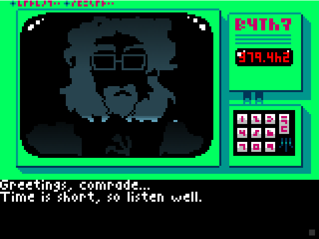
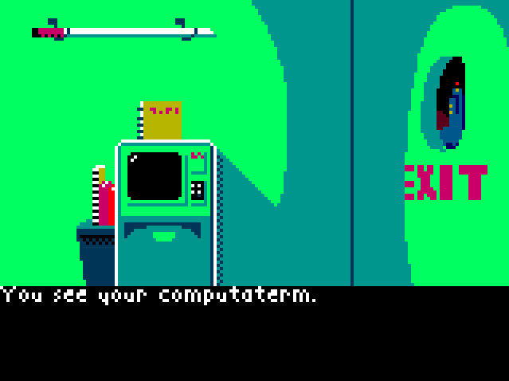

# What is lonoma?

A disease?  No!  Lonoma is a game written for the Love2D engine.
It's pure science fiction and is set in a world with a bit of history.
Enjoy (and use its code to make your own adventure, if you want)!

## Screenshots

## Credits

The music and sounds are all CC0-licensed or in the public domain.
For specific details about each media file, see CREDITS.
